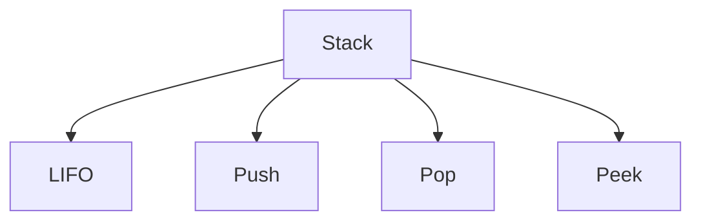

# NoteKori

## Implementation Plan

### AI-Powered Whiteboard-to-Interactive Study Workspace

---

## 1. Project Overview

**NoteKori** is an AI-powered learning application that converts classroom whiteboards, handwritten notes, flowcharts, diagrams, and pseudocode into an interactive digital study workspace.

A student uploads an image containing Bangla, English, code, diagrams, or mixed handwritten content. NoteKori analyzes the image using:

```text
gemma-4-26b-a4b-it
```

The application then generates:

* Clean and structured study notes
* Extracted and corrected code
* Easy Bangla explanations
* An animated Obsidian-style mind map
* Interactive flashcards
* Quiz questions
* Text highlighting while reading
* Markdown export
* PDF export

The application will use:

* **Backend:** FastAPI
* **Frontend:** Next.js with TypeScript
* **Styling:** Tailwind CSS
* **Animations:** Framer Motion
* **Package manager:** Yarn
* **AI model:** `gemma-4-26b-a4b-it`

---

# 2. Main User Flow

```text
Upload Whiteboard or Notes Image
                ↓
FastAPI Validates and Preprocesses Image
                ↓
Image Sent to gemma-4-26b-a4b-it
                ↓
Gemma Extracts Text, Code and Relationships
                ↓
FastAPI Validates Structured JSON
                ↓
Next.js Displays Interactive Study Workspace
                ↓
 ┌──────────────┼─────────────────┐
 ↓              ↓                 ↓
Study Notes   Mind Map        Flashcards
 ↓              ↓                 ↓
Highlights   Animated Graph      Quiz
                ↓
       Export as Markdown or PDF
```

---

# 3. Technology Stack

## Frontend

* Next.js
* TypeScript
* Tailwind CSS
* Framer Motion
* React Markdown
* React Force Graph
* Zustand
* Lucide React
* Yarn

## Backend

* FastAPI
* Python
* Pydantic
* HTTPX
* Pillow
* OpenCV
* Python Markdown
* WeasyPrint
* Uvicorn

## AI

```text
Model: gemma-4-26b-a4b-it
```

The API key will only be stored on the backend. It must never be exposed inside the Next.js frontend.

---

# 4. Project Structure

```text
notekori/
│
├── backend/
│   ├── app/
│   │   ├── main.py
│   │   ├── config.py
│   │   │
│   │   ├── api/
│   │   │   ├── routes/
│   │   │   │   ├── analyze.py
│   │   │   │   ├── export.py
│   │   │   │   ├── highlights.py
│   │   │   │   └── health.py
│   │   │   └── router.py
│   │   │
│   │   ├── schemas/
│   │   │   ├── analysis.py
│   │   │   ├── flashcard.py
│   │   │   ├── mindmap.py
│   │   │   └── highlight.py
│   │   │
│   │   ├── services/
│   │   │   ├── gemma_service.py
│   │   │   ├── image_service.py
│   │   │   ├── markdown_service.py
│   │   │   └── pdf_service.py
│   │   │
│   │   ├── prompts/
│   │   │   └── analysis_prompt.py
│   │   │
│   │   └── utils/
│   │       ├── json_parser.py
│   │       └── file_utils.py
│   │
│   ├── generated/
│   ├── .env
│   ├── .env.example
│   ├── requirements.txt
│   └── README.md
│
├── frontend/
│   ├── src/
│   │   ├── app/
│   │   │   ├── page.tsx
│   │   │   ├── layout.tsx
│   │   │   └── globals.css
│   │   │
│   │   ├── components/
│   │   │   ├── upload/
│   │   │   │   ├── ImageUploader.tsx
│   │   │   │   └── AnalysisProgress.tsx
│   │   │   │
│   │   │   ├── notes/
│   │   │   │   ├── StudyGuide.tsx
│   │   │   │   ├── CodeBlock.tsx
│   │   │   │   └── HighlightToolbar.tsx
│   │   │   │
│   │   │   ├── mindmap/
│   │   │   │   ├── MindMap.tsx
│   │   │   │   └── MindMapControls.tsx
│   │   │   │
│   │   │   ├── flashcards/
│   │   │   │   ├── FlashcardDeck.tsx
│   │   │   │   └── Flashcard.tsx
│   │   │   │
│   │   │   ├── quiz/
│   │   │   │   └── QuizPanel.tsx
│   │   │   │
│   │   │   └── export/
│   │   │       └── ExportPanel.tsx
│   │   │
│   │   ├── hooks/
│   │   │   ├── useTextSelection.ts
│   │   │   └── useAnalysis.ts
│   │   │
│   │   ├── lib/
│   │   │   ├── api.ts
│   │   │   └── types.ts
│   │   │
│   │   └── store/
│   │       └── useNoteKoriStore.ts
│   │
│   ├── .env.local
│   ├── package.json
│   └── yarn.lock
│
├── .gitignore
└── README.md
```

---

# 5. Environment Configuration

## Backend `.env`

Create this file:

```text
backend/.env
```

Add:

```env
APP_NAME=NoteKori
APP_ENV=development

API_HOST=0.0.0.0
API_PORT=8000

GEMMA_API_KEY=PASTE_YOUR_API_KEY_HERE
GEMMA_API_BASE_URL=https://YOUR_GEMMA_API_PROVIDER_ENDPOINT/v1
GEMMA_MODEL=gemma-4-26b-a4b-it

FRONTEND_ORIGIN=http://localhost:3000

MAX_UPLOAD_SIZE_MB=10
GENERATED_FILES_DIRECTORY=generated
```

Replace:

```env
GEMMA_API_KEY=PASTE_YOUR_API_KEY_HERE
```

with the real API key.

Replace:

```env
GEMMA_API_BASE_URL=https://YOUR_GEMMA_API_PROVIDER_ENDPOINT/v1
```

with the endpoint provided by the API provider.

## Backend `.env.example`

```env
APP_NAME=NoteKori
APP_ENV=development

API_HOST=0.0.0.0
API_PORT=8000

GEMMA_API_KEY=
GEMMA_API_BASE_URL=
GEMMA_MODEL=gemma-4-26b-a4b-it

FRONTEND_ORIGIN=http://localhost:3000

MAX_UPLOAD_SIZE_MB=10
GENERATED_FILES_DIRECTORY=generated
```

The `.env` file must be added to `.gitignore`.

```gitignore
backend/.env
frontend/.env.local
backend/generated/
```

## Frontend `.env.local`

Create:

```text
frontend/.env.local
```

Add:

```env
NEXT_PUBLIC_API_BASE_URL=http://localhost:8000/api/v1
```

Do not put the Gemma API key in this file because variables beginning with `NEXT_PUBLIC_` can be visible in the browser.

---

# 6. Backend Implementation

## 6.1 FastAPI Configuration

The FastAPI application will:

* Receive image uploads
* Validate file type and size
* Preprocess images
* Call the Gemma API
* Validate the generated JSON
* Generate Markdown files
* Generate PDF files
* Return results to the frontend

## Main API Routes

```text
GET    /api/v1/health
POST   /api/v1/analyze
POST   /api/v1/export/markdown
POST   /api/v1/export/pdf
```

### Health Endpoint

```text
GET /api/v1/health
```

Example response:

```json
{
  "status": "healthy",
  "application": "NoteKori",
  "model": "gemma-4-26b-a4b-it"
}
```

### Analyze Endpoint

```text
POST /api/v1/analyze
```

Input:

```text
multipart/form-data
image: uploaded image
```

The endpoint will:

1. Validate the uploaded image.
2. Preprocess the image.
3. Send it to Gemma.
4. Parse the model response.
5. Validate the result with Pydantic.
6. Return structured JSON.

---

# 7. Image Preprocessing

The backend will preprocess the image before sending it to the model.

## Processing Steps

* Convert the image to RGB
* Correct orientation
* Resize large images
* Improve contrast
* Sharpen unclear writing
* Reduce unnecessary image noise
* Preserve diagrams and arrows

## Libraries

```text
Pillow
OpenCV
NumPy
```

For the initial MVP, preprocessing should remain lightweight to avoid damaging handwritten text.

---

# 8. Gemma Analysis Pipeline

The model will receive:

* The uploaded image
* A detailed system instruction
* A strict JSON response format

## Main Prompt

```text
You are NoteKori, an intelligent multilingual classroom-note analysis system.

Analyze the uploaded educational image carefully.

The image may contain:

- Bangla handwriting
- English handwriting
- Mixed Bangla-English notes
- Programming code
- Pseudocode
- Mathematical expressions
- Flowcharts
- Diagrams
- Arrows and relationships
- Partially erased or unclear text

Complete the following tasks:

1. Identify the subject, title and main topic.
2. Extract all readable text.
3. Separate Bangla text, English text and code.
4. Organize the content into structured Markdown notes.
5. Preserve the teacher's original meaning.
6. Mark uncertain text instead of silently correcting it.
7. Assign confidence scores to uncertain content.
8. Detect spelling, syntax and code errors.
9. Suggest corrections with explanations.
10. Generate an easy Bangla explanation.
11. Generate important concepts and definitions.
12. Generate nodes and edges for a mind map.
13. Generate flashcards at different difficulty levels.
14. Generate multiple-choice and short-answer questions.
15. Generate exam-focused questions.
16. Generate a one-minute revision summary.

Return only valid JSON matching the required schema.
```

---

# 9. Structured API Response

The response should follow this structure:

```json
{
  "title": "Stack Data Structure",
  "subject": "Data Structures and Algorithms",
  "languages": ["Bangla", "English"],
  "confidence_score": 0.91,
  "extracted_text": "Original detected content",
  "clean_notes": "# Stack Data Structure...",
  "bangla_explanation": "Stack হলো...",
  "key_concepts": [
    {
      "name": "LIFO",
      "definition": "Last In, First Out"
    }
  ],
  "code_blocks": [
    {
      "language": "python",
      "original_code": "stack.apend(10)",
      "corrected_code": "stack.append(10)",
      "explanation": "append was misspelled"
    }
  ],
  "uncertain_content": [
    {
      "text": "Possible detected text",
      "confidence": 0.65,
      "reason": "Handwriting was unclear"
    }
  ],
  "mindmap": {
    "nodes": [
      {
        "id": "stack",
        "label": "Stack",
        "category": "main",
        "description": "A LIFO data structure"
      }
    ],
    "edges": [
      {
        "source": "stack",
        "target": "lifo",
        "relationship": "follows"
      }
    ]
  },
  "flashcards": [
    {
      "id": "card-1",
      "question": "What principle does a stack follow?",
      "answer": "LIFO",
      "difficulty": "beginner",
      "topic": "Stack"
    }
  ],
  "quiz": [
    {
      "question": "Which item is removed first?",
      "options": ["10", "20", "30", "All"],
      "correct_answer": "30",
      "explanation": "A stack follows LIFO."
    }
  ],
  "exam_questions": [],
  "revision_summary": "Stack follows LIFO..."
}
```

---

# 10. JSON Validation

Gemma may occasionally return:

* Markdown code fences
* Missing fields
* Invalid JSON
* Additional explanatory text

The backend should:

1. Remove JSON code fences.
2. Extract the JSON section.
3. Parse it safely.
4. Validate it using Pydantic.
5. Apply default values for optional fields.
6. Return a clear error when parsing fails.

For important fields such as `title`, `clean_notes`, `mindmap`, and `flashcards`, the backend can perform one correction request when the response is invalid.

---

# 11. Frontend Interface

The Next.js application will use a responsive dashboard layout.

## Main Sections

```text
1. Upload
2. Study Guide
3. Mind Map
4. Flashcards
5. Quiz
6. Highlights
7. Export
```

A left sidebar can be used for navigation on desktop, while a horizontal tab menu can be used on mobile.

---

# 12. Upload Interface

The upload page will include:

* Drag-and-drop image uploader
* Image preview
* Analyze button
* Processing progress
* Error display
* Example image button

## Processing Animation

Framer Motion can display animated stages:

```text
Uploading image
      ↓
Improving readability
      ↓
Analyzing with Gemma
      ↓
Building study guide
      ↓
Generating mind map
      ↓
Creating flashcards
```

The stages should animate smoothly rather than showing a single loading spinner.

---

# 13. Study Guide Reader

The generated Markdown notes will be displayed using:

```text
react-markdown
remark-gfm
rehype-highlight
```

The reader will support:

* Headings
* Tables
* Lists
* Code blocks
* Bangla text
* Definitions
* Error corrections
* Uncertain-content warnings

Framer Motion can animate each section as it enters the page.

Example:

```tsx
<motion.section
  initial={{ opacity: 0, y: 16 }}
  animate={{ opacity: 1, y: 0 }}
  transition={{ duration: 0.35 }}
>
  <StudyGuide />
</motion.section>
```

---

# 14. Smooth Animated Obsidian-Style Mind Map

The mind map should feel similar to Obsidian’s graph view.

## Recommended Library

```text
react-force-graph-2d
```

This library provides:

* Force-directed graph movement
* Smooth physics simulation
* Node dragging
* Canvas-based rendering
* Zooming
* Panning
* Hover detection
* Click events
* Animated node positioning

## Required Mind Map Features

* Main topic displayed at the center
* Related concepts connected around it
* Smooth animated node movement
* Draggable nodes
* Zoom and pan
* Search for a topic
* Highlight connected nodes
* Click a node to open its explanation
* Hover tooltip
* Reset graph button
* Full-screen mode
* Animated relationships
* Category-based node sizes

## Node Categories

```text
Main topic
Subtopic
Definition
Example
Code
Error
Exam concept
```

## Smooth Animation Behavior

When the graph first loads:

1. Nodes gradually appear.
2. Nodes move into position using force simulation.
3. Edges fade into view.
4. The main topic receives a subtle pulse animation.
5. Clicking a node smoothly centers it.
6. Connected nodes become more visible.
7. Unrelated nodes become slightly transparent.

## Graph Interaction

```tsx
<ForceGraph2D
  graphData={graphData}
  enableNodeDrag
  enableZoomInteraction
  enablePanInteraction
  cooldownTicks={120}
  d3AlphaDecay={0.025}
  d3VelocityDecay={0.3}
  onNodeClick={handleNodeClick}
  onNodeHover={handleNodeHover}
/>
```

Framer Motion can animate the graph panel, controls and selected-node details. The force-graph library should handle the actual node physics.

## Mind Map Search

The user can type:

```text
Underflow
```

The application will:

* Find the matching node
* Smoothly zoom toward it
* Highlight the node
* Display its explanation
* Highlight directly connected concepts

## Markdown Export Version

Because the animated graph cannot be embedded directly in Markdown, the backend will also generate a Mermaid version:



---

# 15. Generated Flashcards

Flashcards will be generated automatically from:

* Definitions
* Important concepts
* Code
* Examples
* Common mistakes
* Examination topics

## Flashcard Features

* Show question first
* Click to flip
* Animated card rotation
* Previous card
* Next card
* Shuffle
* Mark as easy
* Mark as difficult
* Restart session
* Progress indicator
* Filter by difficulty
* Filter by topic

## Framer Motion Flip Animation

```tsx
<motion.div
  animate={{ rotateY: isFlipped ? 180 : 0 }}
  transition={{
    duration: 0.5,
    type: "spring",
    stiffness: 120
  }}
>
  {/* Flashcard content */}
</motion.div>
```

## Flashcard Progress

```text
Card 4 of 10
Reviewed: 40%
Easy: 2
Difficult: 1
```

## Difficult-Card Review

Cards marked as difficult should appear again at the end of the session.

---

# 16. Interactive Quiz

The quiz section will include:

* Multiple-choice questions
* True-or-false questions
* Short-answer questions
* Code-output questions
* Error-identification questions

After answering, the student will see:

* Correct or incorrect status
* Correct answer
* Explanation
* Related study-guide section
* Updated score

## Final Quiz Report

```text
Score: 8/10
Understanding level: Good
Strong topic: Stack operations
Weak topic: Stack overflow
Recommended revision: Review exceptional conditions
```

---

# 17. Text Highlighting

Students should be able to select text while reading and save highlights.

## Highlight Categories

* Important
* Definition
* Difficult
* Understood

## User Flow

```text
Select text
    ↓
Floating toolbar appears
    ↓
Choose highlight category
    ↓
Highlighted text is saved
    ↓
Highlight appears in My Highlights
```

## Frontend Implementation

Use the browser Selection and Range APIs.

The `useTextSelection` hook will capture:

* Selected text
* Section ID
* Start position
* End position
* Highlight category

Example highlight object:

```json
{
  "id": "highlight-1",
  "section_id": "stack-definition",
  "selected_text": "A stack follows the LIFO principle.",
  "category": "important",
  "start_offset": 12,
  "end_offset": 47
}
```

## Floating Highlight Toolbar

```text
[Important] [Definition] [Difficult] [Understood] [Remove]
```

The toolbar should use Framer Motion:

```tsx
<motion.div
  initial={{ opacity: 0, scale: 0.9 }}
  animate={{ opacity: 1, scale: 1 }}
  exit={{ opacity: 0, scale: 0.9 }}
>
  <HighlightToolbar />
</motion.div>
```

## Highlight Persistence

For the MVP, highlights can be stored in:

```text
localStorage
```

For a later production version, highlights can be stored in a database.

## My Highlights Panel

```text
Important
- A stack follows the LIFO principle.

Definitions
- Peek displays the top element without removing it.

Difficult
- Difference between overflow and underflow.
```

Saved highlights must also appear in exported Markdown and PDF files.

---

# 18. Markdown Export

The Markdown export will include:

* Project title
* Uploaded-image information
* Extracted text
* Structured study guide
* Bangla explanation
* Corrected code
* Uncertain content
* Mermaid mind map
* Flashcards
* Quiz questions and answers
* Exam questions
* Revision summary
* User highlights

## Endpoint

```text
POST /api/v1/export/markdown
```

The backend will return a downloadable `.md` file.

Example filename:

```text
NoteKori_Stack_Data_Structure.md
```

---

# 19. PDF Export

The PDF export will include:

* Cover page
* Topic and subject
* Uploaded image
* Study notes
* Bangla explanation
* Mind map snapshot or static graph
* Code blocks
* Flashcards
* Quiz
* Revision section
* User highlights

## Endpoint

```text
POST /api/v1/export/pdf
```

## Export Pipeline

```text
Structured Result
      ↓
Markdown Content
      ↓
HTML Template
      ↓
CSS Styling
      ↓
WeasyPrint
      ↓
PDF File
```

Example filename:

```text
NoteKori_Stack_Data_Structure.pdf
```

The PDF must use a Unicode-compatible font that supports both Bangla and English.

---

# 20. Frontend State Management

Use Zustand to store:

```text
Uploaded image
Analysis result
Selected section
Mind map data
Flashcard progress
Quiz score
Saved highlights
Export status
```

Example store structure:

```ts
interface NoteKoriState {
  analysis: AnalysisResult | null;
  highlights: Highlight[];
  flashcardIndex: number;
  difficultCardIds: string[];
  quizScore: number;

  setAnalysis: (result: AnalysisResult) => void;
  addHighlight: (highlight: Highlight) => void;
  removeHighlight: (id: string) => void;
  setFlashcardIndex: (index: number) => void;
}
```

---

# 21. API Communication

Create a reusable API client inside:

```text
frontend/src/lib/api.ts
```

Required functions:

```ts
analyzeImage(file: File)
exportMarkdown(result: AnalysisResult, highlights: Highlight[])
exportPdf(result: AnalysisResult, highlights: Highlight[])
```

The frontend should display clear error messages for:

* Invalid image
* Image too large
* API key missing
* Model request failure
* Invalid model response
* Export failure

---

# 22. Installation Commands

## Backend

```bash
cd backend

python -m venv .venv
source .venv/bin/activate
```

On Windows:

```bash
.venv\Scripts\activate
```

Install dependencies:

```bash
pip install fastapi uvicorn python-multipart pydantic pydantic-settings httpx pillow opencv-python-headless numpy markdown weasyprint
```

Create:

```text
requirements.txt
```

```txt
fastapi
uvicorn
python-multipart
pydantic
pydantic-settings
httpx
pillow
opencv-python-headless
numpy
markdown
weasyprint
```

Run the backend:

```bash
uvicorn app.main:app --reload --port 8000
```

## Frontend

Create the Next.js application:

```bash
yarn create next-app frontend \
  --typescript \
  --tailwind \
  --eslint \
  --app \
  --src-dir \
  --import-alias "@/*"
```

Install dependencies:

```bash
cd frontend

yarn add framer-motion react-force-graph-2d react-markdown remark-gfm rehype-highlight zustand lucide-react clsx tailwind-merge zod
```

Run the frontend:

```bash
yarn dev
```

Frontend address:

```text
http://localhost:3000
```

Backend address:

```text
http://localhost:8000
```

FastAPI documentation:

```text
http://localhost:8000/docs
```

---

# 23. Two-Hour MVP Development Order

A fully polished production application is not realistic within two hours. However, a strong demonstration-ready MVP can be built by following this order.

## Phase 1: Setup — 10 Minutes

* Create FastAPI backend
* Create Next.js frontend
* Add Tailwind CSS
* Add `.env`
* Configure CORS
* Test frontend-to-backend connection

## Phase 2: Gemma Integration — 25 Minutes

* Build the image upload endpoint
* Connect `gemma-4-26b-a4b-it`
* Create the structured analysis prompt
* Parse the JSON response
* Test with one sample whiteboard image

## Phase 3: Study Guide Interface — 20 Minutes

* Build drag-and-drop upload
* Display generated Markdown
* Display Bangla explanation
* Display code corrections
* Add loading animations

## Phase 4: Animated Mind Map — 20 Minutes

* Install `react-force-graph-2d`
* Convert nodes and edges into graph data
* Add drag, zoom and pan
* Add node-click details
* Add smooth graph loading

## Phase 5: Flashcards — 15 Minutes

* Display generated flashcards
* Add card-flip animation
* Add next and previous controls
* Add difficulty marking
* Add progress display

## Phase 6: Highlighting — 10 Minutes

* Detect selected text
* Display floating toolbar
* Save highlights in local storage
* Show highlights in a separate panel

## Phase 7: Export — 10 Minutes

* Generate Markdown
* Add Markdown download
* Convert content to PDF
* Add PDF download

## Phase 8: Testing — 10 Minutes

* Test one clear English image
* Test one Bangla-English image
* Fix broken layouts
* Capture screenshots
* Prepare the demo flow

---

# 24. MVP Priorities

## Must-Have Features

* Image upload
* Gemma image analysis
* Structured study guide
* Bangla-English support
* Animated mind map
* Generated flashcards
* Basic text highlighting
* Markdown export
* PDF export

## Secondary Features

* Quiz score
* Difficult-flashcard repetition
* Graph search
* Full-screen mind map
* Code syntax highlighting
* Weak-topic detection

## Future Features

* User accounts
* Cloud storage
* Multiple notebooks
* Collaborative notes
* Spaced repetition
* Audio explanation
* Offline mode
* Teacher dashboard
* Mobile application
* Note sharing
* Editable mind maps

---

# 25. Demo Scenario

## Input

Upload a whiteboard image containing:

```text
Stack Data Structure
LIFO
Push
Pop
Peek
stack.apend(10)
Stack overflow?
Stack underflow?
```

## NoteKori Output

The application should demonstrate:

1. Extracted whiteboard text
2. Corrected Python code
3. Structured study guide
4. Easy Bangla explanation
5. Smooth animated mind map
6. Interactive flashcards
7. Text highlighting
8. Markdown download
9. PDF download

---

# 26. Definition of Done

The MVP will be considered complete when:

* A student can upload a whiteboard image.
* FastAPI sends the image to `gemma-4-26b-a4b-it`.
* The model returns structured educational content.
* The Next.js interface displays the study guide.
* The mind map moves smoothly and supports interaction.
* Flashcards can be flipped and navigated.
* Students can select and highlight text.
* Highlights remain visible during the session.
* The complete result can be downloaded as Markdown.
* The complete result can be downloaded as PDF.
* The Gemma API key remains protected on the backend.
* The application can be demonstrated from beginning to end without manually changing the output.

---

# 27. Final Product Description

**NoteKori** transforms messy classroom materials into a complete interactive study environment.

It does not only extract text from an image. It:

* Understands multilingual educational content
* Reconstructs organized notes
* Detects code errors
* Generates explanations
* Builds an animated knowledge graph
* Creates interactive flashcards
* Supports active reading through highlighting
* Produces portable Markdown and PDF study materials

This makes NoteKori a complete AI-assisted learning workflow rather than a basic vision-to-text application.
